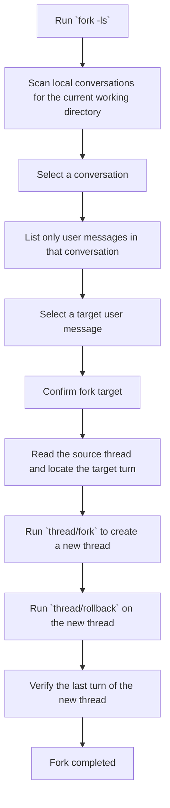

# Codex Any-Node Fork

中文说明: [README_CN.md](./README_CN.md)

A lightweight Windows tool for browsing local Codex Desktop / Codex CLI conversations by working directory, creating a fork from any selectable conversation node, and switching between local Codex account profiles. It now includes both an interactive CLI and a graphical GUI.

## Features

- Filter local Codex conversations by the current working directory
- Navigate conversations with the keyboard
- Browse conversations and user messages in a graphical interface
- The GUI uses a modern dark dashboard layout with a status rail, recent workdirs, and split content panels
- Show only user messages as fork candidates
- Create a new branch thread with `fork + rollback`
- Switch Codex accounts by copying `config.toml` and `auth.json` from a prepared account folder into the target Codex home
- Back up the existing target account files automatically before an account switch
- Remember selected or used work directories in the GUI and prefer them on the next launch
- Refresh the conversation list manually from the GUI
- Refresh the conversation list automatically when the work directory changes
- Refresh the conversation list automatically after a successful fork
- Transfer conversations between local accounts with account-aware grouping, manual assignment, and multi-select copy
- Use CLI transfer commands to inspect grouped conversations, assign ownership, and copy sessions to another account

## Requirements

- Windows
- Python 3.10+
- Codex Desktop or Codex CLI installed
- Access to a local Codex sessions directory

This project uses only the Python standard library.

## Quick Start

For first-time setup, beginners can run:

```powershell
.\add_to_user_path.cmd
```


Run:

```powershell
fork -ls
```

Launch the GUI:

```powershell
fork --gui
```

On Windows this path prefers launching the GUI as a detached no-console process.

Or use the dedicated launcher:

```powershell
fork-gui
```

The launcher prefers `pythonw` so the GUI does not keep an extra `cmd` window open.


If the project directory is not in `PATH`, use:

```powershell
.\fork.cmd -ls
```

Or run the script directly:

```powershell
python .\scripts\fork_cli.py -ls
```

Or:

```powershell
python .\scripts\fork_gui.py
```

List switchable accounts:

```powershell
fork --list-accounts
```

Switch to a specific account:

```powershell
fork --switch-account user1
```

If your account source folders live outside the default location, pass:

```powershell
fork --list-accounts --accounts-root D:\path\to\accounts
```

Inspect transfer groups for the current workdir:

```powershell
fork --list-transfer-view --accounts-root D:\path\to\accounts
```

Assign conversations to an account in the transfer mapping:

```powershell
fork --assign-conversations-to user1 --transfer-sources THREAD_ID_1 THREAD_ID_2
```

Copy conversations to another account:

```powershell
fork --copy-conversations-to api --transfer-sources THREAD_ID_1 THREAD_ID_2
```

## Controls

- `↑ / ↓`: move selection
- `Enter`: confirm
- `Backspace`: go back
- `q`: quit

## GUI

- The GUI uses a modern dark card-based layout with a workspace rail and split content panels
- `Workdir` uses an editable dropdown that remembers recently selected or used work directories
- A recent-workdirs list is shown on the left side for one-click switching
- The GUI prefers the last remembered work directory on the next launch
- You can enable “minimize to tray when closing” so the close button hides the window instead of exiting
- `Refresh` button: reload the conversation list for the selected `codex_home` and `workdir`
- Changing `Workdir` triggers an automatic refresh
- The `Account Switcher` panel can browse an accounts root, detect the currently installed profile, and switch with one click
- `F5`: trigger a manual refresh
- Double-click a user message or use `Fork Selected Turn` to create a fork
- After a successful fork, the GUI refreshes the conversation list automatically

After entering a conversation, the tool shows only user messages.
Once a target message is selected, it creates a new thread and rolls that new thread back to the matching turn.

## Simplified Flow



## Project Structure

```text
.
├─ accounts
│  ├─ .gitkeep
│  └─ README.md
├─ add_to_user_path.cmd
├─ fork.cmd
├─ fork-gui.cmd
├─ LICENSE
├─ README.md
├─ README_CN.md
├─ tests
│  └─ test_conversation_transfer.py
└─ scripts
   ├─ account_switcher.py
   ├─ app_state.py
   ├─ conversation_transfer.py
   ├─ desktop_app.py
   ├─ fork_cli.py
   ├─ fork_gui.py
   ├─ gui_theme.py
   ├─ session_tool.py
   ├─ transfer_cli.py
   └─ transfer_dialog.py
```


## Module Roles

- `fork_gui.py`: main dashboard window, workspace browser, account switcher, and fork flow orchestration
- `transfer_dialog.py`: dedicated conversation transfer window and its GUI-only interaction logic
- `fork_cli.py`: primary CLI entrypoint and interactive any-node fork flow
- `transfer_cli.py`: non-interactive transfer commands for listing, assigning, and copying conversations
- `conversation_transfer.py`: transfer domain logic including provider inference, conversation grouping, ownership classification, and copy workflow
- `app_state.py`: local JSON-backed state management for remembered GUI workdirs and account-session mappings
- `desktop_app.py`: shared Codex Desktop restart helpers
- `gui_theme.py`: shared GUI color and typography constants
- `session_tool.py`: rollout packaging, import/export, and thread index maintenance helpers

## Notes

- The original thread is never modified
- Rollback is applied only to the new thread
- After a fork, the tool attempts to load the new thread into Codex automatically via `thread/resume`
- If Codex Desktop is running, the tool also restarts the app to refresh the thread list
- Account switching uses the same `codex_home` directory and overwrites only `config.toml` and `auth.json`
- Existing target account files are backed up into `account-switch-backups\...` before overwrite
- Account sources are discovered from `.\\accounts` first, then from the sibling `..\\codex-user-change` folder if present
- If the new thread still does not appear, reopen Codex manually
- Local GUI state and transfer mapping are stored under `%APPDATA%\codex-any-node-fork` via a shared state layer
- GUI theme constants, desktop restart logic, transfer CLI commands, and the transfer dialog now live in separate modules to reduce maintenance overhead

## License

Licensed under the MIT License.
