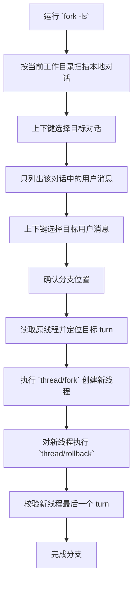

# Codex Any-Node Fork

English version: [README.md](./README.md)

一个面向 Windows 的轻量工具，用于按当前工作目录浏览本地 Codex Desktop / Codex CLI 对话、从任意可选对话节点创建分支线程，并在本地多个 Codex 账户配置之间一键切换。现在同时提供交互式 CLI 和可视化 GUI。

## 功能

- 按当前工作目录筛选本地 Codex 对话
- 使用上下键选择目标对话
- 提供可视化 GUI 浏览对话和用户消息
- GUI 采用深色仪表盘式布局，包含侧边状态区、最近工作目录和双列表内容区
- 仅展示对话中的用户消息作为分支基准
- 对目标线程执行 `fork + rollback`
- 支持把预先准备好的账户目录中的 `config.toml` 和 `auth.json` 一键覆盖到目标 Codex Home
- 切换前自动备份当前目标文件，避免误切换后无法恢复
- GUI 会记住选中过或操作过的工作目录，并在下次启动时优先使用
- GUI 中可手动刷新会话列表
- GUI 中切换工作目录后会自动刷新
- 分支成功后 GUI 会自动刷新列表
- 支持按账户分组查看本地会话，并在多个本地账户之间传递/复制会话
- 支持使用 CLI 查看传递视图、手动修正归属以及复制会话到目标账户

## 要求

- Windows
- Python 3.10+
- 已安装 Codex Desktop / Codex CLI
- 本地存在可访问的 Codex 会话目录

本项目只使用 Python 标准库。

## 快速开始

第一次使用时，可以先运行：

```powershell
.\add_to_user_path.cmd
```

直接运行：

```powershell
fork -ls
```

启动 GUI：

```powershell
fork --gui
```

在 Windows 下，该入口会优先以无控制台窗口的方式分离启动 GUI。

或者直接使用专用启动器：

```powershell
fork-gui
```

该启动器会优先使用 `pythonw`，避免额外停留一个 `cmd` 终端窗口。

如果项目目录还没有加入 `PATH`，可以先这样运行：

```powershell
.\fork.cmd -ls
```

或者：

```powershell
python .\scripts\fork_cli.py -ls
```

也可以直接运行 GUI 脚本：

```powershell
python .\scripts\fork_gui.py
```

列出可切换账户：

```powershell
fork --list-accounts
```

切换到账户 `user1`：

```powershell
fork --switch-account user1
```

如果账户目录不在默认位置，可以额外传入：

```powershell
fork --list-accounts --accounts-root D:\path\to\accounts
```

查看当前工作目录的传递分组视图：

```powershell
fork --list-transfer-view --accounts-root D:\path\to\accounts
```

手动把会话归属到账户：

```powershell
fork --assign-conversations-to user1 --transfer-sources THREAD_ID_1 THREAD_ID_2
```

把会话复制到另一个账户：

```powershell
fork --copy-conversations-to api --transfer-sources THREAD_ID_1 THREAD_ID_2
```

## 交互方式

- `↑ / ↓`：切换选项
- `Enter`：确认
- `Backspace`：返回上一级
- `q`：退出

## GUI

- GUI 采用现代化深色卡片布局，工作目录状态、最近记录和操作区分层展示
- `Workdir` 使用可输入的下拉框，会记住最近选中过或执行过操作的工作目录
- 左侧会显示最近工作目录列表，点击即可切换
- 下次启动 GUI 时，会优先使用上次记住的工作目录
- 可以勾选“关闭时最小化到系统托盘”，关闭窗口时不直接退出
- `Refresh` 按钮：按当前 `codex_home` 和 `workdir` 重新加载会话列表
- 切换 `Workdir` 后会自动刷新列表
- `Account Switcher` 区块可浏览账户根目录、识别当前已安装配置，并一键执行切换
- `F5`：手动刷新列表
- 双击用户消息，或点击 `Fork Selected Turn` 执行分支
- 分支成功后，GUI 会自动刷新会话列表

进入某个对话后，程序只显示用户消息。
选定目标消息后，会创建一个新线程，并将新线程回滚到该消息对应的 turn。

## 简化流程



## 项目结构

```text
.
├─ accounts
│  ├─ .gitkeep
│  └─ README.md
├─ add_to_user_path.cmd
├─ fork.cmd
├─ fork-gui.cmd
├─ LICENSE
├─ README.md
├─ README_CN.md
├─ tests
│  └─ test_conversation_transfer.py
└─ scripts
   ├─ account_switcher.py
   ├─ app_state.py
   ├─ conversation_transfer.py
   ├─ desktop_app.py
   ├─ fork_cli.py
   ├─ fork_gui.py
   ├─ gui_theme.py
   ├─ session_tool.py
   ├─ transfer_cli.py
   └─ transfer_dialog.py
```


## 模块职责

- `fork_gui.py`：主仪表盘窗口、工作目录浏览、账户切换和 fork 流程编排
- `transfer_dialog.py`：独立的会话传递窗口及其 GUI 交互逻辑
- `fork_cli.py`：主 CLI 入口和交互式 any-node fork 流程
- `transfer_cli.py`：非交互式会话传递命令，负责查看、归属和复制会话
- `conversation_transfer.py`：传递领域逻辑，包括 provider 推断、会话分组、归属分类和复制流程
- `app_state.py`：基于本地 JSON 的 GUI 状态和账号-会话映射管理
- `desktop_app.py`：共享的 Codex Desktop 重启逻辑
- `gui_theme.py`：共享 GUI 颜色和字体配置
- `session_tool.py`：rollout 打包、导入导出和线程索引维护

## 说明

- 不会修改原线程
- 只会对新创建的线程执行 rollback
- fork 完成后，工具会先尝试通过 `thread/resume` 自动把新线程加载进 Codex
- 如果 Codex Desktop 正在运行，工具还会自动重启 App 来刷新线程列表
- 账户切换与 fork 共用同一个 `codex_home`，只覆盖其中的 `config.toml` 和 `auth.json`
- 目标文件在覆盖前会备份到 `account-switch-backups\...`
- 账户源目录会优先从项目内 `.\\accounts` 查找；如果不存在，再兼容同级目录 `..\\codex-user-change`
- 如果新线程仍然没有显示出来，再手动重新打开 Codex
- GUI 状态和会话归属映射统一保存在 `%APPDATA%\codex-any-node-fork`，由共享状态层负责读写
- GUI 主题、桌面重启逻辑、传递 CLI 命令和传递弹窗已经拆分到独立模块，降低后续维护成本

## License

Licensed under the MIT License.
